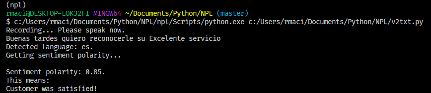
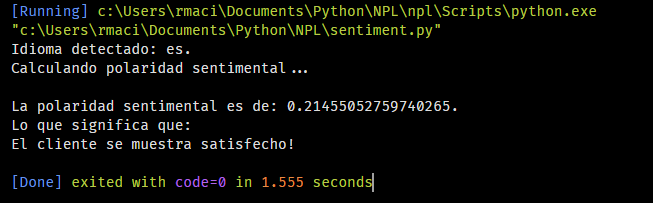

# Natural Language Processing

Un par de Scripts de Python para Análisis de Sentimientos.

## Voice to Text

El Script "v2txt.py" utiliza el micrófono del computador para captar la frase que el usuario diga ya sea en inglés o español (se puede configurar para cualquier idioma).

El Script toma el audio y lo trabscribe a texto usando la API de reconocimiento de voz de Google.

Posteriormente analiza la intención del texto para obtener una "polaridad sentimental" el cual es un valor entre -1 y 1.

- Valores negativos connotan una intención negativa.

- El cero connota una intención neutral.

- Valores positivos connotan una intención positiva.

Un ejemplo del resultado:

## Sentiment Analysis on plain text

El script "sentiment.py" realiza análisis de sentimientos sobre texto como input.

En este caso se utilizó una conversación entre el presidente de Estados Unidos, Donald Trump y el presidente de Ucrania, Volodímir Zelenski en formato Word (se puede configurar para cualquier formato).

Como resultado obtenemos el siguiente resultado:

Podemos ver que el resultado es correcto con el primer párrafo de la conversación:

> Donald Trump: Felicitaciones por su gran victoria. Todos te hemos visto desde Estados Unidos e hiciste un trabajo estupendo. Viniste de atrás, alguien a quien no se le dio mucha importancia y terminaste ganando fácilmente. Es un fantástico logro. Enhorabuena.

Este análisis se puede automatizar para realizarse sobre todos los archivos de texto contenidos en una carpeta por ejemplo y arroje un análisis por cada archivo de texto.

## Installation

- Tener Python instalado.
- Instalar PyAudio.
- Descargar los archivos de este repositorio.
- Intalar requirements.txt
